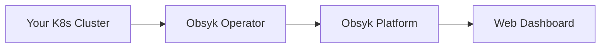

# Welcome to Obsyk

**Observability & Security for AI Workloads**

Obsyk provides comprehensive visibility and security monitoring for your Kubernetes clusters, with a focus on AI and ML workloads.

## What is Obsyk?

Obsyk is a platform that helps you:

- **Monitor** your Kubernetes clusters in real-time
- **Track** resources across namespaces and workloads
- **Secure** your AI infrastructure with continuous visibility
- **Audit** changes and maintain compliance

## Quick Links

- :material-rocket-launch: **[Getting Started](getting-started/introduction.md)**
  New to Obsyk? Start here.

- :material-kubernetes: **[Install Operator](operator/installation.md)**
  Deploy the Obsyk operator to your cluster.

- :material-book-open-variant: **[User Guide](user-guide/overview.md)**
  Learn how to use the Obsyk platform.

- :material-api: **[API Reference](https://developers.obsyk.ai)**
  Explore the REST API documentation.

## How It Works

1. **Install the Operator** - Deploy the lightweight Obsyk operator to your Kubernetes cluster
2. **Automatic Discovery** - The operator discovers and monitors all resources in real-time
3. **Centralized View** - Access your cluster data through the Obsyk web dashboard

## Need Help?

- Check the [Troubleshooting Guide](reference/troubleshooting.md)
- Open an issue on [GitHub](https://github.com/obsyk/docs/issues)
