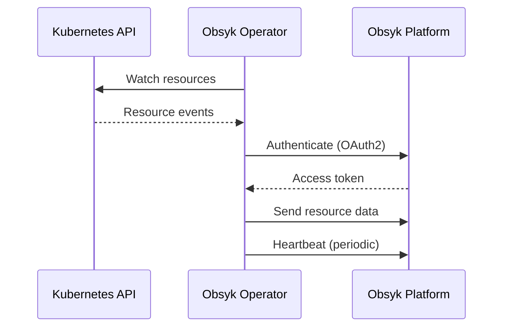

# Operator Overview

The Obsyk Operator is a lightweight Kubernetes controller that collects and reports cluster data to the Obsyk platform.

## What It Does

The operator:

- **Watches** Kubernetes resources using the API server
- **Collects** metadata and status information
- **Reports** changes to the Obsyk platform in real-time
- **Authenticates** using OAuth2 JWT Bearer flow

## Resource Types Monitored

The operator monitors these Kubernetes resources:

| Category | Resources |
|----------|-----------|
| **Core** | Namespaces, Pods, Services, Nodes |
| **Workloads** | Deployments, StatefulSets, DaemonSets, ReplicaSets, Jobs, CronJobs |
| **Networking** | Ingresses, NetworkPolicies, Endpoints |
| **Configuration** | ConfigMaps, Secrets |
| **Storage** | PersistentVolumeClaims |
| **RBAC** | ServiceAccounts, Roles, ClusterRoles, RoleBindings, ClusterRoleBindings |

## How It Works

1. **Startup** - Operator authenticates with Obsyk using client credentials
2. **Initial Sync** - Sends a full snapshot of all resources
3. **Continuous Watch** - Streams resource changes as they occur
4. **Heartbeat** - Periodic health check to maintain connection

## Security

- Runs with minimal RBAC permissions (read-only)
- Secrets content is hashed, not transmitted
- All communication is TLS encrypted
- Credentials stored as Kubernetes secrets
