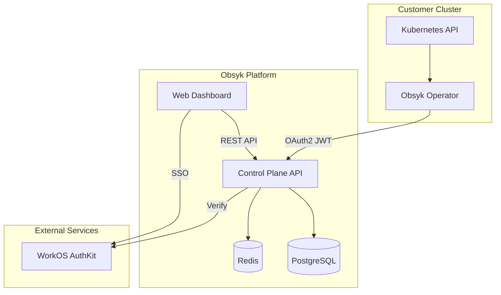

# Architecture

Technical overview of the Obsyk platform architecture.

## System Components

## Data Flow

### Operator to Platform

1. **Authentication** - Operator authenticates using OAuth2 client credentials (RFC 7523)
2. **Initial Snapshot** - On startup, sends full inventory of all watched resources
3. **Event Streaming** - Continuously sends resource change events (add/update/delete)
4. **Heartbeat** - Periodic health check to maintain connection status

### Platform APIs

| Endpoint | Purpose |
|----------|---------|
| `POST /api/v1/agent/snapshot` | Receive full resource snapshot |
| `POST /api/v1/agent/events` | Receive resource change events |
| `POST /api/v1/agent/heartbeat` | Connection health check |
| `GET /api/v1/clusters` | List clusters (UI) |
| `GET /api/v1/clusters/:id/agents` | Get cluster resources (UI) |

## Security Model

### Authentication

- **Users** - WorkOS AuthKit with magic links and SAML SSO
- **Operators** - OAuth2 JWT Bearer with client certificates

### Authorization

- Role-based access control (RBAC) at organization level
- Cluster data isolated by organization

### Data Protection

- All communication over TLS
- Secrets hashed before transmission
- Sensitive data encrypted at rest

## Deployment Architecture

### Obsyk Platform

- Deployed on self-hosted Kubernetes
- GitOps with ArgoCD
- Kustomize for environment configuration
- Cloudflare Tunnel for ingress

### Operator

- Runs as a Deployment in customer cluster
- Single replica (leader election for HA optional)
- Minimal RBAC permissions (read-only cluster-wide)
